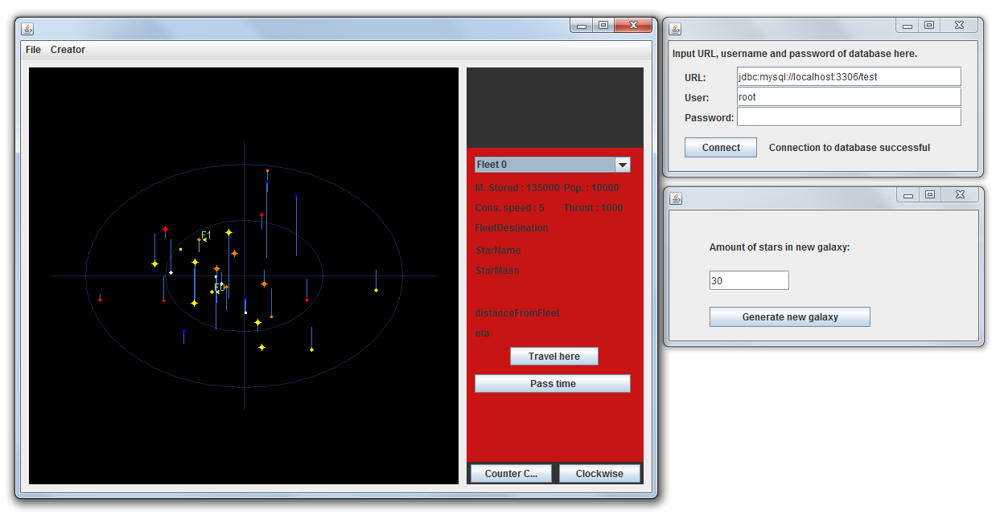

STARHOPPER

An extremely simple 3D engine and "game" where you can move a couple of fleets around between stars. Also includes database functionality to store a single set of stars (aka. a galaxy), and then modify it.

**Installation:**
---
- Download source & run in IDE
OR
- Download StarHopper.jar & run

**Usage:**
---
Optional: From "File" in the menubar choose "Connect to DB" and add in the URL, user and password fields required data to make a connection and click the button. If successful, "Connection to database successful" will appear next to the button. If unsuccessful, the program will still (mostly) work without a database. The connection window can now be closed.

From "File" in the menubar, select "New game", input desired amount of stars in the appearing window and click "Generate new galaxy" as many times as you want. Close (or don't) the galaxy creation window.

You can resize the window however you want, but it works best at a 4:3 ratio.

Press and hold down on the "Counter C..." & "Clockwise" buttons at the bottom right of the window to rotate the view. Left-click on stars to select them, right click to unselect. Select one of your two fleets from the dropdown bar at the top right to select a fleet. When a star is selected click "Travel here" to set it as a destination for the currently selected fleet. Click "Pass time" to run time until a fleet reaches it's destination. 

note: Fleet 0 must always have a destination for "Pass time" to work.

**Database stuff:**

- File/Export: Saves the current galaxy in the database (!!!OVERWRITEs the old!!!).
- File/Import: Loads the stored galaxy from the database.

You will have to import after the following actions if you want to see the results:

- File/Fix galaxy in DB: Modifies the stored (custom) galaxy so that the graphics will mostly work correctly.
- Creator/Create star to DB: Adds a random star to the stored database.
- Creator/Delete star to DB: Removes a star from the database.

---

Credits: Juho Vainio